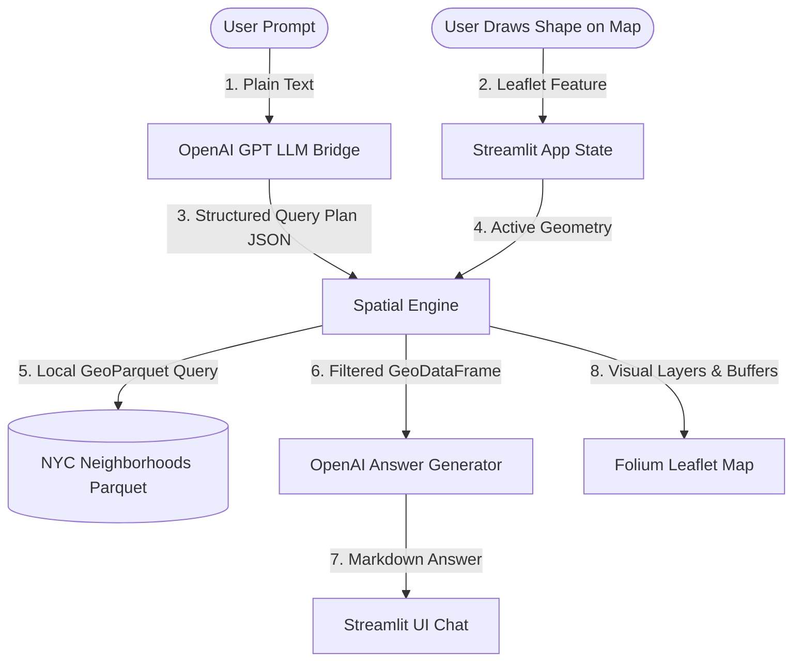

# 🗺️ Project Record: SpatialRAG Application
**Project Title:** Natural Language Spatial Query Engine for NYC Fire Hydrant Density  
**Domain:** Geographic Information Systems (GIS), Large Language Models (LLMs), Web Development  
**Author:** Kolla Srinivas  

---

## 1. Introduction & Objectives

### 1.1 Project Overview
Modern Database Systems and Geographic Information Systems (GIS) store massive volumes of geospatial data. However, querying this data traditionally requires expert knowledge of Structured Query Language (SQL) extensions (like PostGIS) or programmatic libraries (such as GeoPandas and Shapely). 

**SpatialRAG** (Spatial Retrieval-Augmented Generation) bridges this gap. It allows non-technical users to query geospatial databases using natural, colloquial English (e.g., *"Top 5 densest neighborhoods in Manhattan within 3km of Times Square"*). The system translates natural language queries into a structured geometric execution plan, performs vector-based calculations on local spatial datasets, and renders interactive visual reports.

### 1.2 Problem Statement
Standard RAG pipelines query text documents using vector embeddings, but they fail when answering queries requiring geometric relationships, proximity searches, and spatial aggregation (e.g., intersection, buffer, boundary containment). SpatialRAG solves this by implementing a **hybrid parser-execution architecture**:
1. **LLM Parser Layer:** Extracts spatial intent, attributes, operations, and landmarks into a structured query plan.
2. **Local GIS Execution Layer:** Runs high-performance spatial algorithms on local datasets to ensure perfect mathematical correctness.

---

## 2. System Architecture

The application is structured as a decoupled, state-preserving pipeline:



### 2.1 Workflow Pipeline
1. **Input Stage:** The user enters a question in the chat interface, optionally drawing a region of interest (Circle, Polygon, Rectangle) on the map.
2. **Intent Parsing:** The text query is sent to OpenAI's GPT model using **Structured Outputs**. The response is strictly validated against a custom Pydantic schema to produce a JSON-based execution plan.
3. **Context Injection:** If the user drew a shape on the map, the application intercepts the query plan and automatically overrides or injects the drawn shape's coordinates as a spatial constraint.
4. **Execution Stage:** The spatial engine executes the structured query plan on the NYC Neighborhood Tabulation Area (NTA) dataset using vector operations.
5. **Metric Reprojection:** Geometries are dynamically reprojected to a metric CRS (**EPSG:32618 - UTM Zone 18N**) to execute distance-based buffer searches in meters/kilometers instead of angular degrees.
6. **Rendering Stage:** The execution result is formatted, passed back to the LLM to generate a natural response, and highlighted on the interactive Folium map.

---

## 3. Data Model & Geospatial Processing

### 3.1 Datasets
The project uses the official **2020 NYC Neighborhood Tabulation Areas (NTA)** and **NYC Fire Hydrant** datasets, merged into a single optimized GeoParquet file (`data/data.parquet`).

*   **CRS:** WGS 84 (`EPSG:4326` - Latitude/Longitude).
*   **Coordinate Reference System for Proximity Calculations:** Universal Transverse Mercator (UTM) Zone 18N (`EPSG:32618`), whose unit is **meters**.
*   **Attributes:**
    *   `ntacode`: Unique neighborhood identifier.
    *   `ntaname`: Neighborhood name (e.g., "Gramercy", "Upper West Side").
    *   `boroname`: Borough name (Manhattan, Brooklyn, Queens, Bronx, Staten Island).
    *   `hydrant_count`: Integer count of hydrants in the boundary.
    *   `area_km2`: Area of the neighborhood boundary in square kilometers.
    *   `hydrants_per_km2`: Calculated hydrant density.
    *   `geometry`: Multipolygon outline representing the neighborhood boundary.

---

## 4. Query Plan Specification

To guarantee predictability, the LLM converts the natural language query into a strict Pydantic model (`QueryPlan`).

### 4.1 Schema Definition
```python
class SpatialOp(BaseModel):
    type: Literal["nearest", "within_distance", "within_polygon", "buffer"]
    lat: Optional[float] = None
    lon: Optional[float] = None
    distance_km: Optional[float] = None
    neighborhood: Optional[str] = None
    polygon: Optional[List[List[float]]] = None
    n: Optional[int] = 5

class AttributeFilter(BaseModel):
    column: str
    op: Literal["eq", "neq", "gt", "gte", "lt", "lte", "in", "between", "contains"]
    value: Any

class SortSpec(BaseModel):
    by: str
    order: Literal["asc", "desc"] = "desc"

class LimitSpec(BaseModel):
    n: int

class AggregateSpec(BaseModel):
    column: str
    op: Literal["sum", "mean", "min", "max", "count"]
    group_by: Optional[str] = None

class QueryPlan(BaseModel):
    spatial_op: Optional[SpatialOp] = None
    filters: Optional[List[AttributeFilter]] = None
    sort: Optional[SortSpec] = None
    limit: Optional[LimitSpec] = None
    aggregate: Optional[AggregateSpec] = None
```

---

## 5. Software Design & Core Modules

The codebase is split into modular components, isolating the user interface from the heavy GIS backend:

### 5.1 [spatial_engine.py](file:///home/asus/.venv_linux/Matt/accelerator/part3-web/spatial_rag/spatial_engine.py) (Local GIS Calculations)
Performs pure vector and geometry operations on the Pandas/GeoPandas dataframes.

*   `_within_distance`: Creates a buffer of `X` kilometers around a target coordinate.
    ```python
    # Reproject WGS84 coordinates to UTM Zone 18N to calculate distances in meters
    gdf_metric = gdf.to_crs("EPSG:32618")
    point_metric = gpd.GeoSeries([Point(lon, lat)], crs="EPSG:4326").to_crs("EPSG:32618").iloc[0]
    buffer_metric = point_metric.buffer(distance_km * 1000)
    
    # Run spatial intersection mask
    mask = gdf_metric.geometry.intersects(buffer_metric)
    result = gdf[mask].copy()
    ```
*   `_within_polygon`: Computes points or polygons intersecting with a custom user-drawn polygon coordinate list (`[[lon, lat], ...]`).

### 5.2 [llm_bridge.py](file:///home/asus/.venv_linux/Matt/accelerator/part3-web/spatial_rag/llm_bridge.py) (The LLM Parser Layer)
Bridges text queries to the execution engine.
*   **Geocoding Fallback:** Contains a dictionary of 23 known NYC landmarks (e.g. *Times Square*, *Empire State Building*) with pre-resolved coordinates. The LLM checks this list first to parse landmark-based proximity queries instantly.
*   **Structured Output Engine:** Connects to OpenAI's chat completion using `response_format=QueryPlan` to ensure syntax-perfect JSON query plans.

### 5.3 [map_utils.py](file:///home/asus/.venv_linux/Matt/accelerator/part3-web/spatial_rag/map_utils.py) (Folium Map Layer)
Generates the visual elements.
*   **Color Ramp Map:** Uses a 5-step YlOrRd (Yellow-Orange-Red) sequential scale matching hydrant density classes.
*   **Persistence Layer:** Draws previously saved query geometries (buffers, points, highlights) as static GeoJSON features so they do not disappear when the map re-renders.

### 5.4 [app.py](file:///home/asus/.venv_linux/Matt/accelerator/part3-web/spatial_rag/app.py) (UI and Event Loop)
Manages the application lifecycle.
*   **Asynchronous Event Isolation:** Uses `returned_objects=["all_drawings"]` on the `st_folium` map. It captures any drawn circles or polygons into Streamlit `st.session_state` quietly, without interrupting user typing or triggering auto-execution.
*   **State Management:** Chat transcripts, queries, map bounds, and result dataframes persist dynamically inside `st.session_state` during interaction loops.

---

## 6. Implementation Verification

### 6.1 Sample Execution Run
**User Query:** *"Top 5 highest hydrant density neighborhoods within 3 km of Empire State Building"*

1. **Parsed Query Plan:**
   ```json
   {
     "spatial_op": {
       "type": "within_distance",
       "lat": 40.7484,
       "lon": -73.9857,
       "distance_km": 3.0
     },
     "sort": {
       "by": "hydrants_per_km2",
       "order": "desc"
     },
     "limit": {
       "n": 5
     }
   }
   ```
2. **Execution Outputs:**
   * Proximity center set to `(40.7484, -73.9857)`.
   * A 3,000-meter buffer is generated in `EPSG:32618`.
   * The geometry intersection outputs Manhattan neighborhoods: *Garment District, Chelsea, Midtown, Union Square, Stuyvesant Town*.
   * Results sorted by `hydrants_per_km2` descending and truncated to 5.
3. **Map Visual Feedback:**
   * A blue dashed buffer circle of 3 km is placed around the Empire State Building.
   * The 5 highest density neighborhoods inside the circle are highlighted with bold black borders and deep red filling.

---

## 7. Conclusions & Future Enhancements

### 7.1 Conclusion
SpatialRAG successfully proves that conversational interfaces can execute precise geographic analyses on local datasets. By decoupling intent parsing (LLM) from computational operations (GeoPandas), we achieve the speed of natural language query processing without sacrificing spatial precision.

### 7.2 Future Scope
1. **Dynamic Geocoding:** Integrate a real-time geocoding API (e.g., Nominatim or Google Maps API) to dynamically resolve user landmarks not in the local pre-resolved list.
2. **R-Tree Indexing:** Implement Spatial Indexing (`sindex`) in GeoPandas to accelerate spatial intersection checks across millions of rows.
3. **Multi-layer Support:** Add support for additional spatial layers (e.g. subway entries, school zones, food deserts) to execute multi-criteria decision queries.
